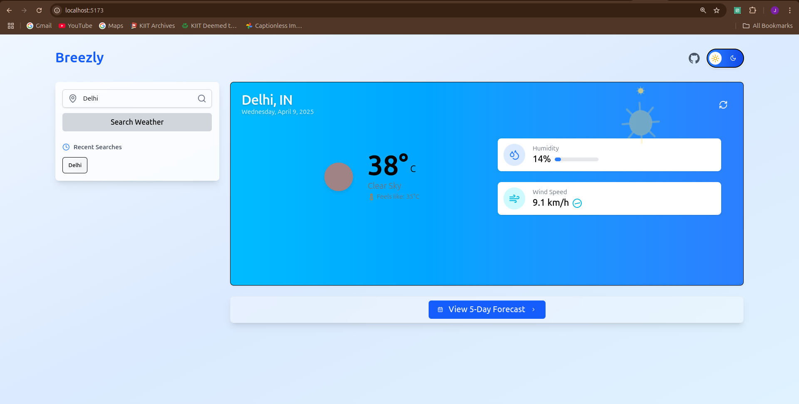
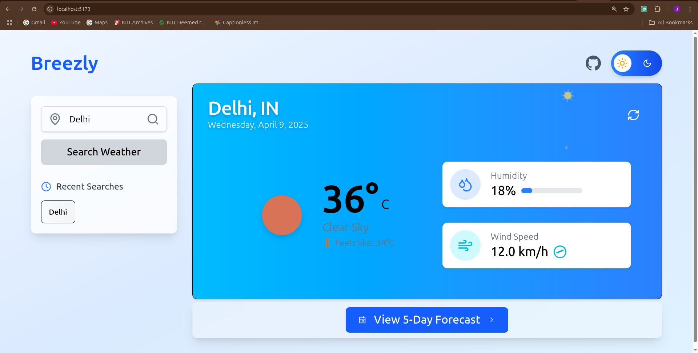
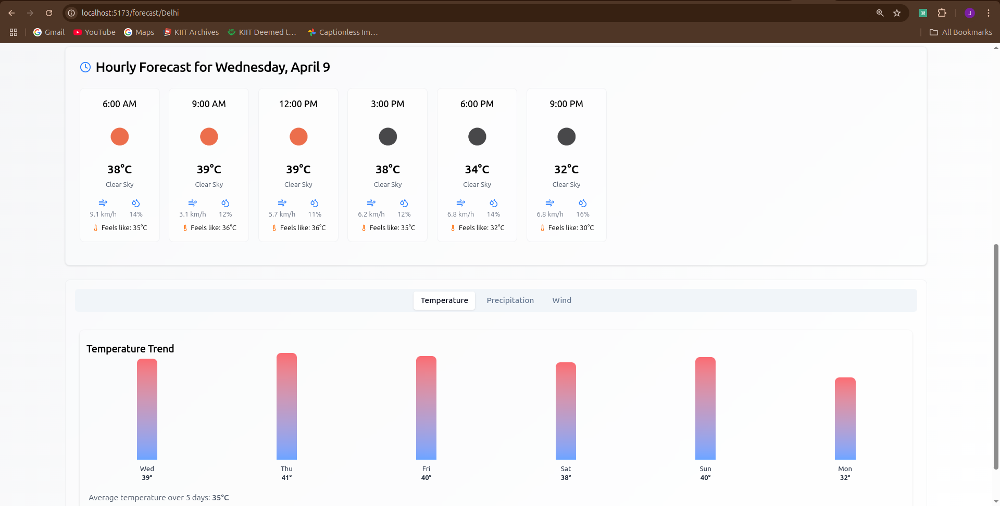

You're very close! The content is great, but there are **some formatting issues** and **extra markdown placeholders** like “Copy” and “Edit” that shouldn't be in a `README.md`. Let me correct and clean up everything for you.

---

### ✅ Here's the **correct and polished version** of your `README.md`:

```markdown
# 🌤️ Breezly – Weather Forecast App

**Breezly** is a beautiful and responsive weather forecasting web application built with **React** and **Tailwind CSS**. It provides real-time weather updates, 5-day forecasts, and detailed hourly trends through intuitive animated charts. Whether you're checking the weather for your commute or planning a trip, Breezly makes it easy to stay informed. It also supports a dynamic theme system, dark/light mode, and stores recent search history for a seamless user experience.



---

## 🚀 Features

- 🔍 **City Weather Search**  
  Search any city worldwide to get real-time weather data powered by the OpenWeatherMap API.

- 🌡️ **Current Weather Overview**  
  Displays current temperature, feels like, weather condition (sunny, cloudy, etc.), humidity, pressure, wind speed, visibility, sunrise/sunset times, and more.

- 📊 **5-Day Forecast & Hourly Charts**  
  - **Line and Bar Charts** for visualizing hourly temperature, precipitation, and wind patterns using Recharts.
  - Forecast data broken into 3-hour segments across the next 5 days.

- 🌓 **Dark/Light Mode Toggle**  
  Users can switch between dark and light themes with smooth transition animations. User preferences are stored and persisted in `localStorage`.

- 🎨 **Dynamic Background Themes**  
  Background visuals adapt based on the time of day (morning, afternoon, evening, night) and weather condition (clear, rainy, stormy, etc.) for a more immersive experience.

- 💾 **Search History**  
  - Last 5 searched cities are saved in `localStorage`.
  - Clickable history entries make re-searching faster.

- ⚠️ **Fallback Data Support**  
  In case the API fails or rate limits are hit, the app shows default weather data for Delhi to maintain user experience.

---

## 🛠️ Tech Stack

| Tool               | Purpose                          |
|--------------------|----------------------------------|
| **React**          | Frontend library                 |
| **Tailwind CSS**   | Utility-first styling framework  |
| **Framer Motion**  | Smooth animations                |
| **Recharts**       | Chart rendering for forecasts    |
| **OpenWeatherMap** | Weather data API                 |
| **React Icons**    | Weather & UI icons               |
| **LocalStorage**   | Theme & history persistence      |

---

## 🖼️ Preview

  


---

## 🧪 Live Demo

You can deploy the app on Vercel, Netlify, or GitHub Pages.  
🔗 [Live Demo](https://breezly-henna.vercel.app/)

---

## 📦 Installation & Setup

Follow the steps below to run Breezly locally on your machine:

### 1. Clone the Repository

```bash
git clone https://github.com/sauravjha1111/breezly-weather-app.git
cd breezly-weather-app
```

### 2. Install Dependencies

```bash
npm install
```

### 3. Create Environment Variables

To fetch data from the OpenWeatherMap API, you'll need an API key.

Create a file named `.env.local` in the root directory of the project and add the following line:

```env
VITE_WEATHER_API_KEY=your_openweathermap_api_key
```

💡 You can get a free API key from [OpenWeatherMap](https://openweathermap.org/api)

✅ Ensure `.env.local` is listed in your `.gitignore` to prevent leaking the API key.

### 4. Start the Development Server

```bash
npm run dev
```

Visit [http://localhost:5173](http://localhost:5173) in your browser to view the app.

---


## 🙋‍♂️ Author

Made with ❤️ by **Saurav Jha**

